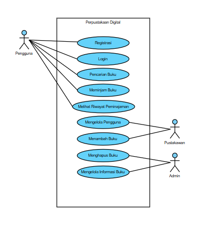

# **Tugas KPPL Week 11**

Nama: Adyuta Prajahita Murdianto

NRP: 5025221186

Kelas: KPPL E

## **Deskripsi Sistem**

Aplikasi perpustakaan digital memungkinkan pengguna untuk mencari, meminjam, membaca, dan mengelola koleksi buku secara online. Sistem ini memiliki tiga jenis pengguna: Pengguna (User), Admin Perpustakaan (Admin), dan Pustakawan.

## **Fitur**

**1. Pengguna**

- Registrasi dan Login.

- Mencari buku berdasarkan judul, pengarang, atau kategori.

- Meminjam buku digital dan membaca secara online.

- Melihat riwayat peminjaman.

**2. Pustakawan**

- Mengelola data pengguna.

- Melihat laporan statistik peminjaman.

**3. Admin**

- Menambahkan buku baru ke dalam koleksi.

- Menghapus buku yang tidak relevan.

- Mengelola informasi detail buku.

## **Use Case Diagram**

